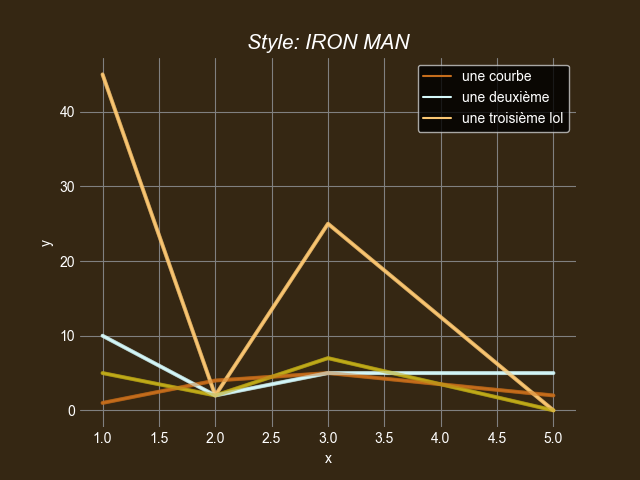

<h2 align="center"> 
   SuperCurves   
</h2>

[![Contributors][contributors-shield]][contributors-url]
[![Issues][issues-shield]][issues-url]

## What's for?
> TO make your CURVES more SPICY-like! :)
> + I have no idea why I'm doing this :)

### Options

Two styles available for now:
* Superman
* IronMan

### Built With

* [Python 3](https://python.org/)

> Project Link: [https://github.com/PhantHive/SuperCurves](https://github.com/PhantHive/SuperCurves)

<!-- MARKDOWN LINKS & IMAGES -->
[contributors-shield]: https://img.shields.io/github/contributors/PhantHive/SuperCurves.svg?style=for-the-badge
[contributors-url]: https://github.com/PhantHive/SuperCurves/graphs/contributors/

[issues-shield]: https://img.shields.io/github/issues/PhantHive/SuperCurves.svg?style=for-the-badge
[issues-url]: https://github.com/PhantHive/SuperCurves/issues/